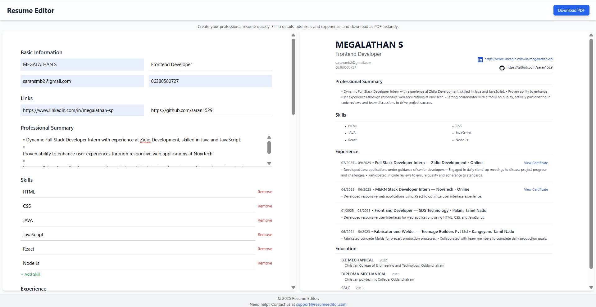
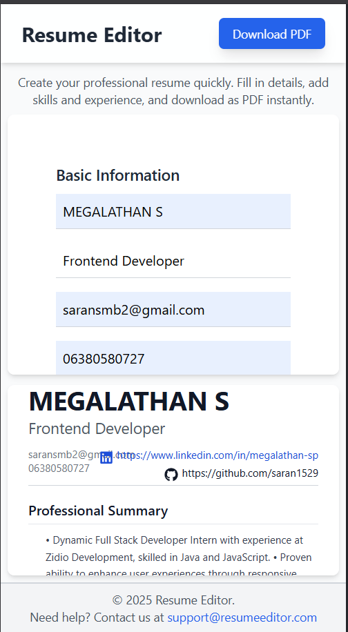
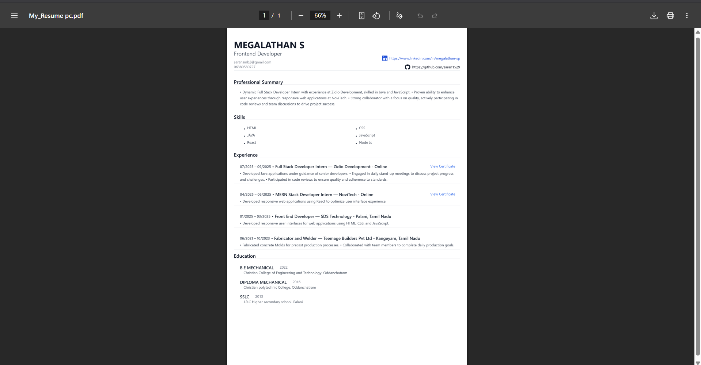

# Zidio Resume Editor

**A React-based resume editor & PDF exporter** — part of the Resume System trial task.  
This project implements a live resume editor with preview and PDF export (desktop + mobile friendly).

## Demo
- Live demo: https://zidio-resume.vercel.app/

## Screenshots

**Desktop View:**  

**Mobile View:**  

**PDF Preview:**  

## Features
- Live resume preview (two-panel editor + preview)
- Add / remove skills, experience, education (auto-focus & keyboard-friendly)
- PDF export using `html2canvas` + `jsPDF`
- Mobile-specific PDF fixes for correct full-page capture, icon alignment & sizing
- Clean, minimal Tailwind UI

## Tech stack
- React
- Tailwind CSS
- jsPDF, html2canvas
- React Icons
- Vite (or create-react-app if used)

## How to run locally

# install deps
npm install

# run dev server
npm run dev

# React + Vite

This template provides a minimal setup to get React working in Vite with HMR and some ESLint rules.

Currently, two official plugins are available:

- [@vitejs/plugin-react](https://github.com/vitejs/vite-plugin-react/blob/main/packages/plugin-react) uses [Babel](https://babeljs.io/) (or [oxc](https://oxc.rs) when used in [rolldown-vite](https://vite.dev/guide/rolldown)) for Fast Refresh
- [@vitejs/plugin-react-swc](https://github.com/vitejs/vite-plugin-react/blob/main/packages/plugin-react-swc) uses [SWC](https://swc.rs/) for Fast Refresh

## React Compiler

The React Compiler is not enabled on this template because of its impact on dev & build performances. To add it, see [this documentation](https://react.dev/learn/react-compiler/installation).

## Expanding the ESLint configuration

If you are developing a production application, we recommend using TypeScript with type-aware lint rules enabled. Check out the [TS template](https://github.com/vitejs/vite/tree/main/packages/create-vite/template-react-ts) for information on how to integrate TypeScript and [`typescript-eslint`](https://typescript-eslint.io) in your project.

